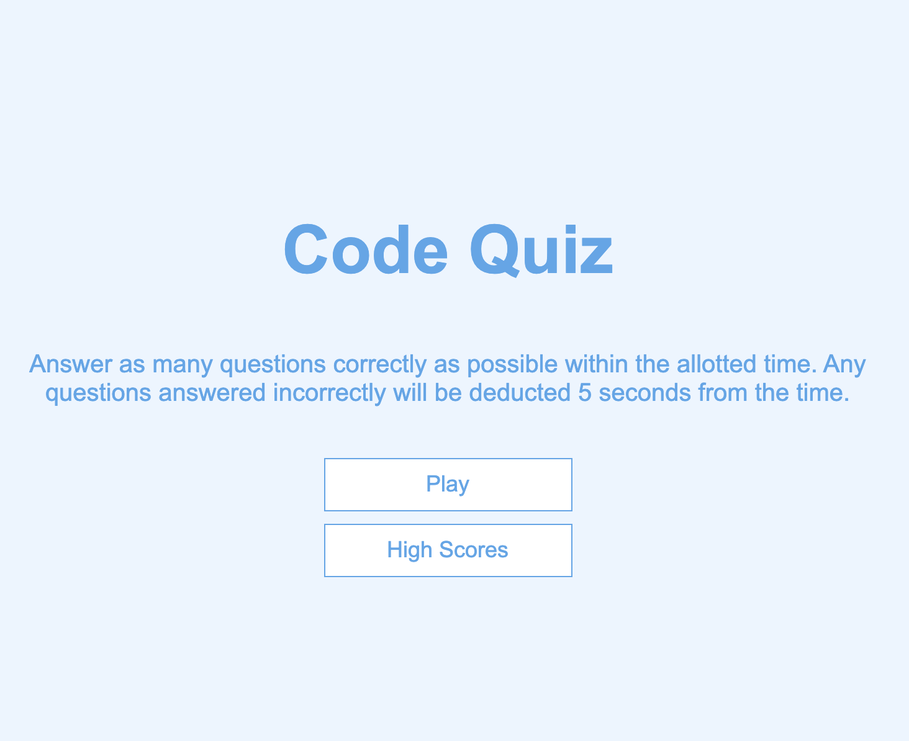
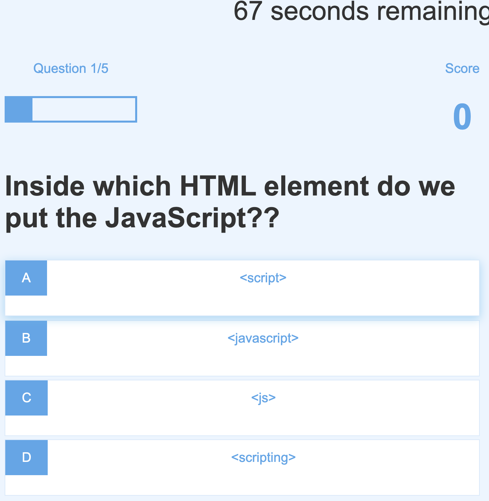
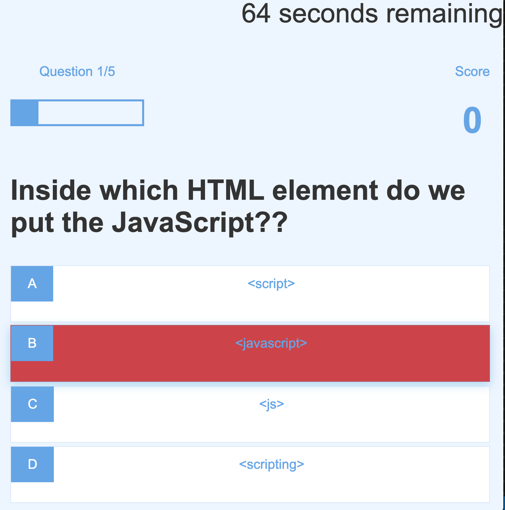
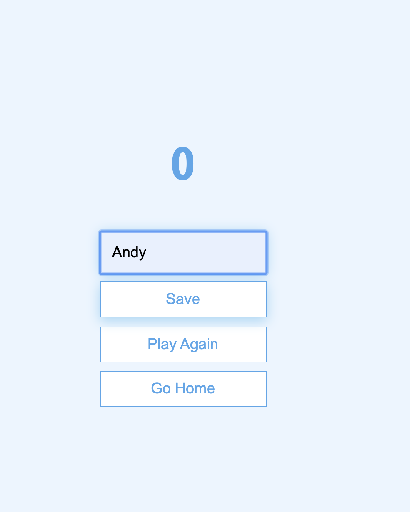
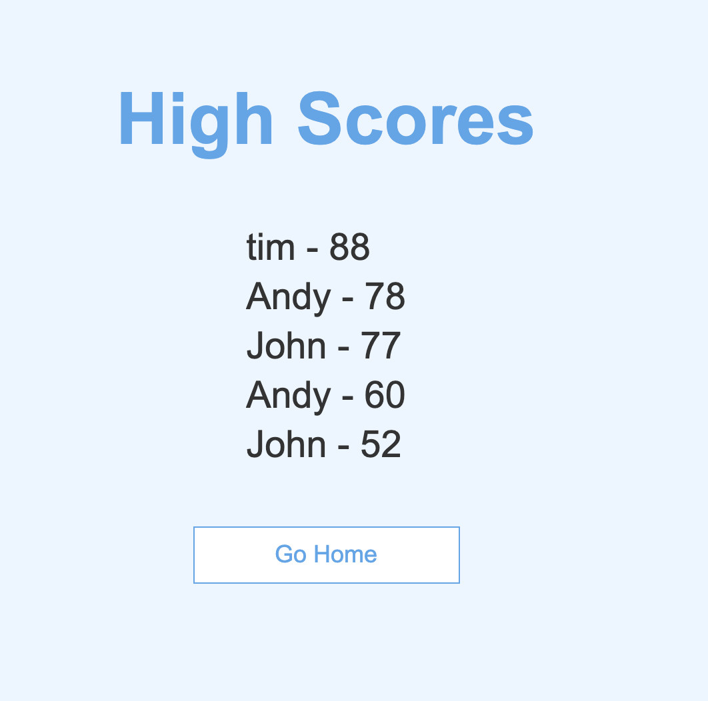

# CODE QUIZ

In this code quiz, I provided 5 questions to the user with 75 seconds as a count down. Every time the user gets a answer wrong, the display box will be highligted red - if correct it will be green. 

Wrong answers will also deduct the user's time by 5 seconds until the timer reaches zero seconds. After 0 seconds then the user will go to the High Score page as they have ran out of time. 

## Purpose and Requirement

Purpose of this quiz creation is to ensure that the user understands the criteria of creating a page that contains variables, localstorage, minimal WEB APIs, a bit of understanding in JQuery, and the three fundamentals usage of HTML, CSS, and Javascript.

1. A Functional, deployed application.
2. The first view of the application displays a button that starts the quiz.
3. Clicking the start button displays a series of questions.
4. Once the quiz begins, a timer starts.
5. If a question is answered incorrectly, additional time is subtracted from the timer.
6. The timer stops when all questions have been answered or the timer reaches 0.
7. After the game ends, the user can save their initials and score to a highscores view using local storage.
8. User can revisit highscores as needed from the home page. 

## Begin Quiz

## Time Ticking

## Questions and Wrong Answer Prompt

## Enter Name

## View High Scores

## Links to GitHub & Live Page

Link to Repo Github:
https://github.com/INKA10/Code-Quiz

Link to Live Page
https://inka10.github.io/Code-Quiz/
